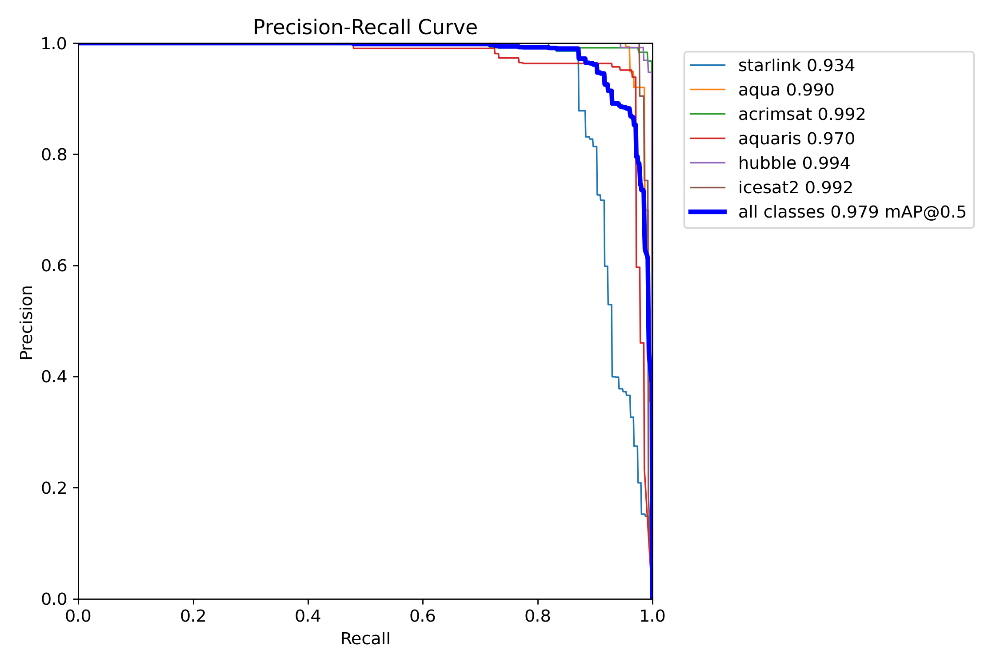
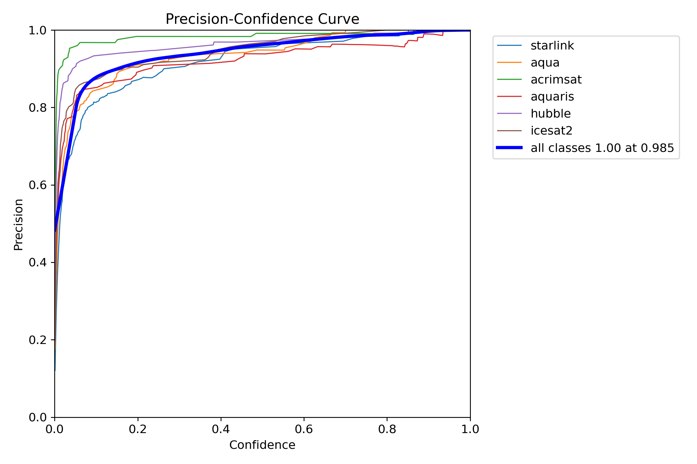
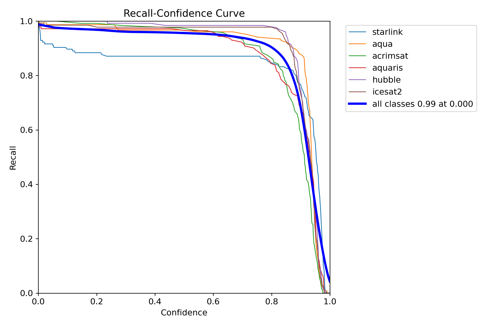

# Satellites Detection and Segmentating
Satellite Detection and Segmentation Dataset:  
YOLOv8n test results: https://disk.yandex.ru/d/FnSvRWFg_gv_ww

  
  

  
  

    Detection training summary
    

  Detection testing summary
  
  

  
  

