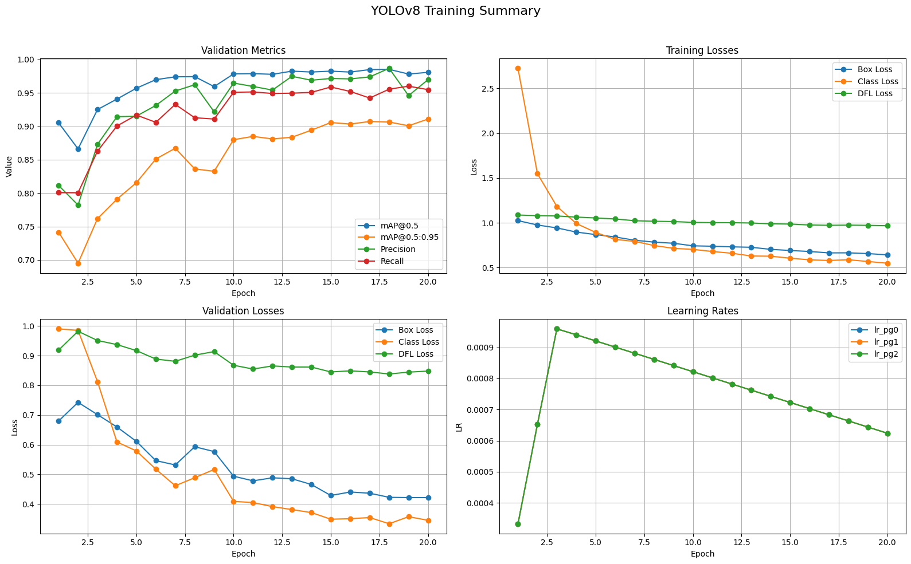

# Satellites Detection and Segmentating
Satellite Detection and Segmentation Dataset: https://disk.yandex.ru/d/4pw-gnY4G391bw  
YOLOv8n test results: https://disk.yandex.ru/d/FnSvRWFg_gv_ww

    Examples

  
  

  
  

    Detection training summary

    

    Detection testing summary

  
  

  
  

